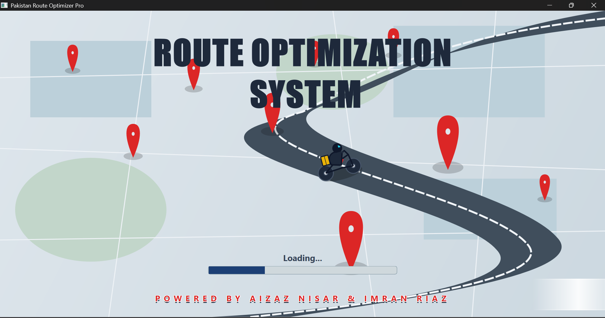
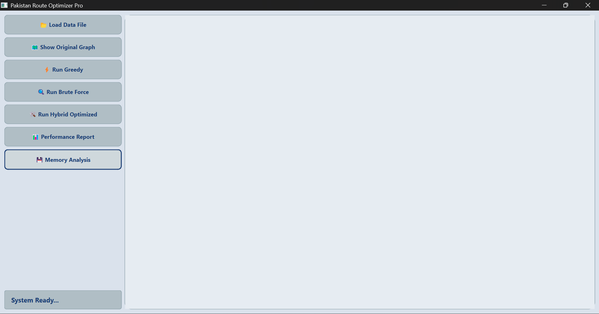
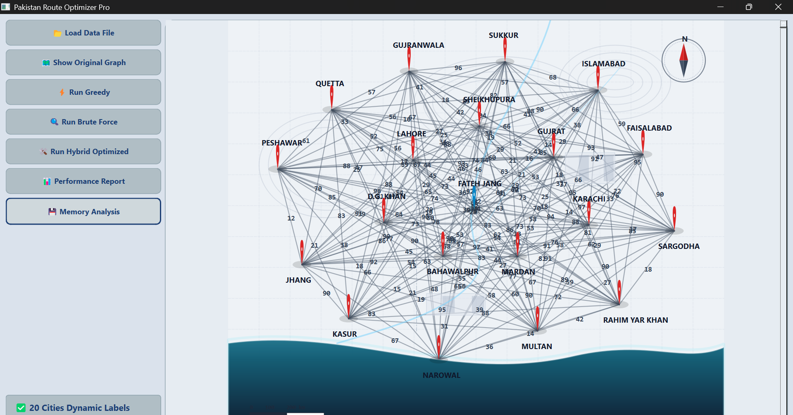
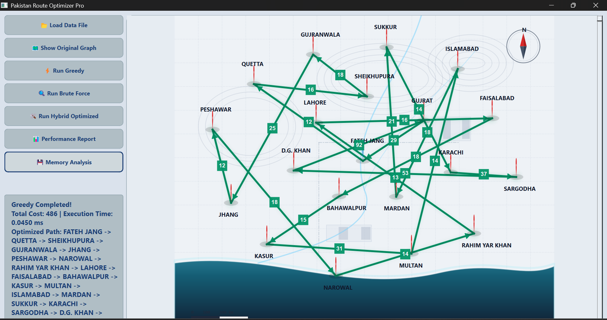
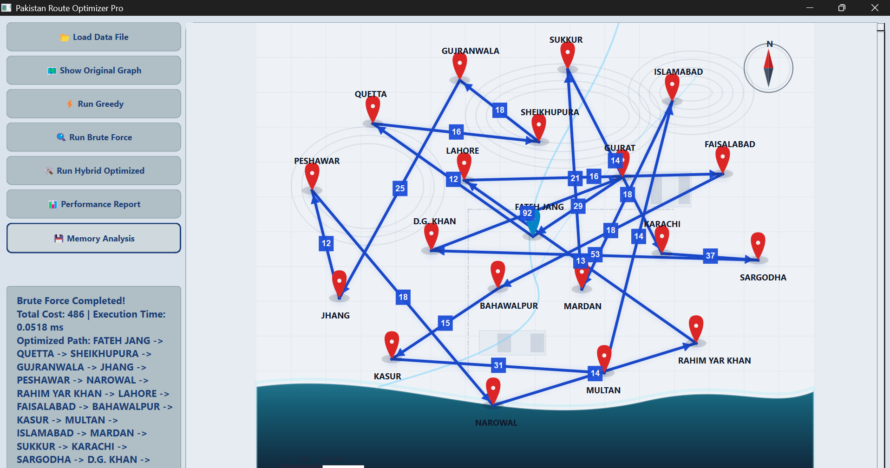
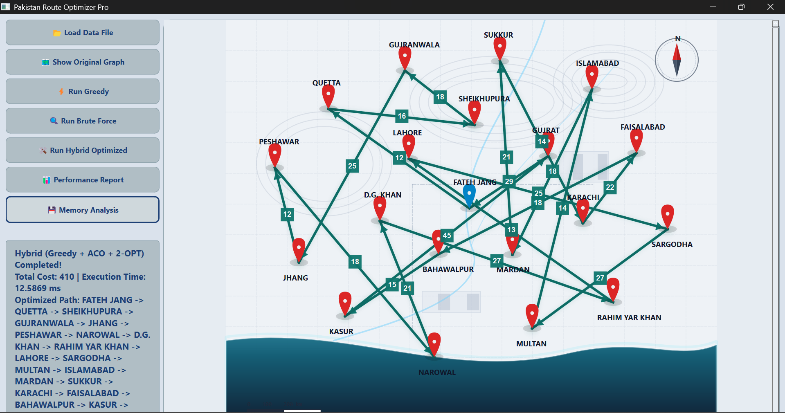
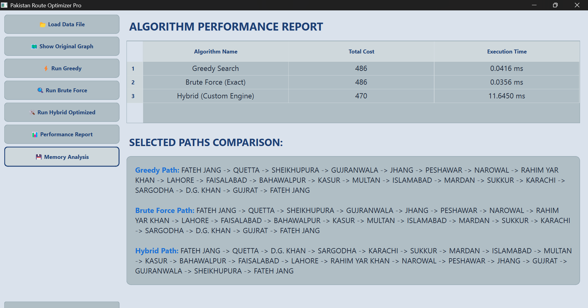
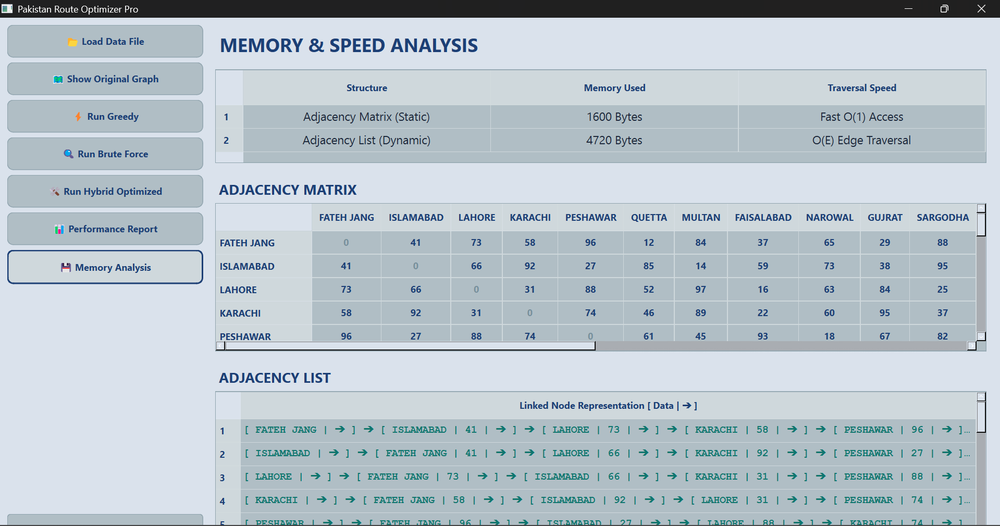

# DSA Route Optimization System
---
# Project Overview
The **DSA Route Optimization System** is a desktop-based application developed using **C++** and **Qt Creator** as part of a Data Structures & Algorithms semester project. The system demonstrates the practical implementation of route optimization and graph traversal concepts through an interactive graphical user interface.
The project focuses on solving pathfinding and route management problems efficiently using algorithmic techniques while providing real-time visual representation of routes and nodes.
---
# Objectives
The main objectives of this project are:
* To apply Data Structures and Algorithms in a real-world scenario
* To implement route optimization techniques
* To visualize graph traversal and pathfinding
* To develop an interactive desktop GUI using Qt Creator
* To improve understanding of optimization strategies and algorithm efficiency
---
# Key Features
* Interactive graphical user interface
* Route optimization visualization
* Graph-based route representation
* Efficient path calculation
* Brute force path evaluation
* Hybrid optimization approach
* Real-time route display
* User-friendly desktop application
---
# Technologies Used
| Technology       | Purpose                       |
| ---------------- | ----------------------------- |
| C++              | Core application logic        |
| Qt Creator       | GUI development               |
| DSA Concepts     | Optimization & graph handling |
| Graph Algorithms | Route calculation             |
---
# Core Concepts Implemented
## Graph Representation
The project models locations and routes as graph structures where:
* Nodes represent locations/cities
* Edges represent paths or connections
* Weights represent route costs or distances
---
## Route Optimization
The application calculates optimized routes between nodes using multiple algorithmic approaches designed to reduce overall travel cost and improve efficiency.
---
## Input Format (Text File Based)
The system reads input from:
|6.txt|
## Format:
|Fateh_Jang Islamabad Lahore Karachi Peshawar Quetta|

|0   25  45  110  35  65|

|25  0   30  85   40  95|

|45  30  0   40   55  80|

|110 85  40  0    70  60|

|35  40  55  70   0   30|

|65  95  80  60   30  0|

---
# Algorithms Used
## Greedy Algorithm
The Greedy Algorithm selects locally optimal choices at each step to quickly generate an efficient route.
### Advantages
* Fast execution
* Simple implementation
* Efficient for smaller datasets
---
## Brute Force Algorithm
The Brute Force Algorithm evaluates all possible route combinations to determine the optimal path.
### Advantages
* Produces the most accurate solution
* Useful for comparing optimization results
* Helps verify the efficiency of other algorithms
### Limitations
* High computational cost
* Slower for large datasets
---
## Hybrid Optimization Algorithm
The Hybrid Optimization Algorithm combines multiple optimization techniques, including:
* Greedy Algorithm
* Ant Colony Optimization (ACO)
* 2-Opt Optimization
This hybrid approach improves overall route quality by combining the speed of Greedy selection, the intelligent path exploration of ACO, and the route refinement capability of 2-Opt optimization.
### Working Principle
1. The Greedy Algorithm generates an initial fast route.
2. Ant Colony Optimization explores better path possibilities using pheromone-based decision making.
3. The 2-Opt algorithm further improves the generated route by minimizing unnecessary path crossings and reducing total distance.
### Advantages
* Better route optimization
* Improved path accuracy
* Reduced total travel distance
* More balanced performance
* Enhanced solution refinement compared to using a single algorithm
---
# System Workflow
1. User launches the application
2. Graph nodes and routes are loaded
3. User selects optimization method
4. Algorithm processes the graph
5. Optimized route is generated
6. Results are displayed visually on the GUI
---
# GUI Components
The graphical user interface includes:
* Route visualization panel
* Node display system
* Interactive controls
* Optimization execution buttons
* Graph rendering interface
---
# Data Structures Used
| Data Structure           | Purpose                     |
| ------------------------ | --------------------------- |
| Vector                   | Store nodes and routes      |
| Graph                    | Represent route connections |
| Priority-based selection | Optimization handling       |
---
# Performance Considerations
The project focuses on:
* Efficient route calculation
* Reduced computational overhead
* Fast visualization updates
* Optimized graph traversal
---
# Challenges Faced
During development, several technical challenges were addressed:
* Managing graph visualization
* Implementing optimization logic
* GUI integration with algorithms
* Handling dynamic route calculations
* Balancing performance and visualization
---
# Learning Outcomes
This project helped strengthen understanding of:
* Data Structures & Algorithms
* Graph theory concepts
* Route optimization techniques
* Desktop application development
* GUI design with Qt Creator
* Problem-solving and debugging
---
# Screenshots
## Main Page

## Interface 

## Orignal Graph

## Greedy Run

## Brute Force Run

## Hybrid Run 

## Performance Report

## Memory Analysis

---
# How to Run the Project
## Requirements
* Qt Creator
* C++ Compiler (MinGW/MSVC)
## Steps
1. Clone or download the repository
2. Open the `.pro` file in Qt Creator
3. Configure the compiler kit
4. Place `6.txt` in the build directory alongside the executable
5. Build the project
6. Click the Run button
---
# Repository
GitHub Repository:
[https://github.com/Muhammad-Imran-Riaz/DSA-Route-Optimization-Syatem]
---
# Developer
## M.Imran Riaz
Data Structures & Algorithms Semester Project
---
# Conclusion
The DSA Route Optimization System successfully demonstrates the application of graph algorithms, optimization techniques, and GUI development in solving practical route management problems. The project combines algorithmic efficiency with interactive visualization, making it both educational and technically valuable.
